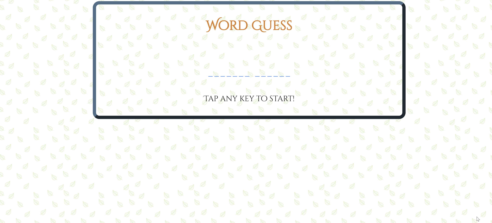

# Word-Guess

Simple hangman game built with vanilla javascript. Try it <a href="https://bksaechao.github.io/Word-Guess/">here</a>!

## Javascript Homework

This assignment challenged students knowlege and application of javascript. students were tasked with creating the hangman game using only javascript, html, & css.

## *(Follow up notes)*
<ul>
  <li>
    There were actually 2 possible assignemnts that students were able to do (letter guess or word guess). I previously did the easier assignment, but this time around I did the harder one and even completed all of the bonus challenges that requried students to re-build the javascript in the Object Oriented Programming Model.
  </li>
  <li>
    Personally it was SUPER challenging, but felt super rewarding once finished!
  </li>
</ul>
